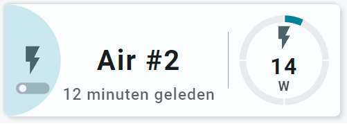
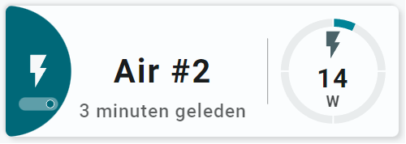
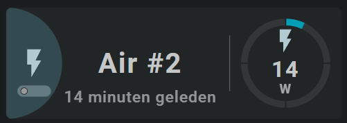
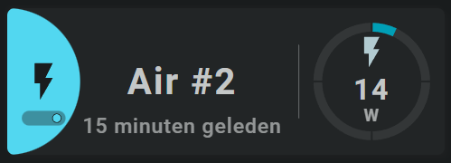

<!-- GT/GL -->
##:sak-sak-logo: Visualization

{width="300"}
{width="300"}
<br>{width="300"}
{width="300"}

This card uses the [Material 3 theme D06, TealBlue][ham3-d06-url]

| Description| Aspect Ratio| Target Size |
|-|-|-|
| A card that controls the on/off state of a power outlet, but also displays the power value. <br>Both using a segmented arc and as state.| 3/1 | Grid with 2 columns |

| SAK Tool| Used for |
|-|-|
| Circle | The half circle, as the left part of the circle is cutoff by the card. Animated, state dependent|
| Icon | Entity Icon. Animated, state dependent|
| Switch | Switch to indicate and control the state. Animated, state dependent|
| Name | Name of Entity|
| State | Secondary Info of entity|
| Line | Vertical line separator|
| SegArc | Segmented arc showing the sensors state with a single color|
| Icon | Entity Icon|
| State | Entity State|

##:sak-sak-logo: Interaction

| Part | Description|
|-|-|
| Card | All tools connected to an entity do show by default the "more-info" dialog once clicked |

##:sak-sak-logo: Usage
[:octicons-tag-24: 1.0.0-rc.3][github-releases]

!!! warning "Replace example entities with your entities!"

```yaml linenums="1"
- type: 'custom:swiss-army-knife-card'
  entities:
    - entity: sensor.kitchen_group_energy_power
      name: 'PwrOutl #2'
    - entity: sensor.kitchen_group_energy_power
      secondary_info: last_changed
      format: relative
    - entity: switch.washingmachine_energy
      name: 'Air #2'
  layout:
    template:
      name: sak_layout_fce_power_outlet2
      variables:
        - sak_layout_power_outlet_segarc_scale_max_watt: 200
```

| Data | Default| Required | Description |
|-|-|-|-|
| entities |  | :material-check: | The single entity on the card |
| sak_layout_power_outlet_segarc_scale_max_watt | 200  | :material-check: | The max value of the scale |


##:sak-sak-logo: YAML Template Definition
[:octicons-tag-24: 1.0.0-rc.3][github-releases]
??? Info "Full definition of layout template"
    ```yaml linenums="1"
    sak_layout_fce_power_outlet2:
      template:
        type: layout
        defaults: 
          - sak_layout_power_outlet_segarc_scale_max_watt: 200
      layout:
        aspectratio: 3/1
        toolsets:
          # ================================================================
          - toolset: column-icon
            position:
              cx: 0
              cy: 50
            tools:
              # ------------------------------------------------------------
              - type: circle
                position:
                  cx: 50
                  cy: 50
                  radius: 50
                entity_index: 2
                animations:
                  - state: 'on'
                    styles:
                      circle:
                        fill: var(--theme-sys-color-primary)
                        # animation: flash 2s ease-in-out 5
                  - state: 'off'
                    styles:
                      circle:
                        fill: var(--theme-sys-color-secondary-container)
                # Remove user actions part to just display the state
                # or disable pointer-events via a class or style
                # Using a class enables the use of variables that can
                # disable pointer-events to none!
                user_actions:
                  tap_action:
                    haptic: light
                    actions:
                      - action: call-service
                        service: switch.toggle
                styles:
                  circle:
                    fill: var(--theme-sys-color-secondary-container)
                    stroke: var(--theme-sys-color-secondary)
                    stroke-width: 0em

              # ------------------------------------------------------------
              - type: icon
                position:
                  cx: 75
                  cy: 50
                  align: center
                  icon_size: 30
                entity_index: 2
                animations:
                  - state: 'on'
                    styles:
                      icon:
                        # animation: spin 3s linear infinite
                        fill: var(--primary-background-color)
                  - state: 'off'
                    styles:
                      icon:
                        # fill: var(--theme-sys-color-on-secondary-container)
                        fill: var(--theme-sys-color-secondary)
                styles:
                  icon:
                    fill: var(--theme-sys-color-secondary)
                    # opacity: 0.7
                    pointer-events: none

          # ================================================================
          - toolset: switch
            position:
              cx: 25                           # On 1/3 of card width
              cy: 75
              scale: 2
            tools:
              # ------------------------------------------------------------
              - type: switch
                position:
                  cx: 50
                  cy: 50
                  orientation: 'horizontal'
                  track:
                    width: 15
                    height: 5
                    radius: 2.5
                  thumb:
                    width: 3
                    height: 3
                    radius: 2.5
                    offset: 4.5
                entity_index: 2
                user_actions:
                  tap_action:
                    haptic: light
                    actions:
                      - action: call-service
                        service: switch.toggle
                styles:
                  track:
                    --switch-checked-track-color: var(--primary-background-color)
                    --switch-unchecked-track-color: var(--theme-sys-color-secondary)
                    # --switch-checked-button-color: 
                  thumb:
                    --thumb-stroke: 'var(--primary-background-color)'
                    
          # ================================================================
          - toolset: column-name
            position:
              cx: 120
              cy: 50
            tools:
              # ------------------------------------------------------------
              - type: name
                position:
                  cx: 50
                  cy: 50
                entity_index: 0
                styles:
                  name:
                    text-anchor: middle
                    font-size: 25em
                    font-weight: 700
                    opacity: 1
              # ------------------------------------------------------------
              - type: state
                position:
                  cx: 50
                  cy: 80
                entity_index: 1
                show:
                  uom: none
                styles:
                  state:
                    text-anchor: middle
                    font-size: 14em
                    font-weight: 500
                    opacity: 0.7

          # ================================================================
          - toolset: line1
            position:
              cx: 200                           # On 1/3 of card width
              cy: 50
            tools:
              # ------------------------------------------------------------
              - type: line
                position:
                  cx: 50
                  cy: 50
                  orientation: vertical
                  length: 50
                styles:
                  line:
                    fill: var(--primary-text-color)
                    opacity: 0.5

          # ================================================================
          - toolset: column-load
            template:
              name: toolset_tutorial_02_part1
              variables:
                - var_entity_index: 0
                - var_toolset_position_cx: 250
                - var_segarc_scale_max: '[[sak_layout_power_outlet_segarc_scale_max_watt]]'
    ```

<!-- Image references -->

<!--- Internal References... --->
[Swiss Army Knife Tutorial 02]: ../tutorials/10-step-tutorial-02-intro.md

<!--- External References... --->
[ham3-d06-url]: https://material3-themes-manual.amoebelabs.com/examples/material3-example-theme-d06-tealblue/
[github-releases]: https://github.com/amoebelabs/swiss-army-knife-card/releases/
